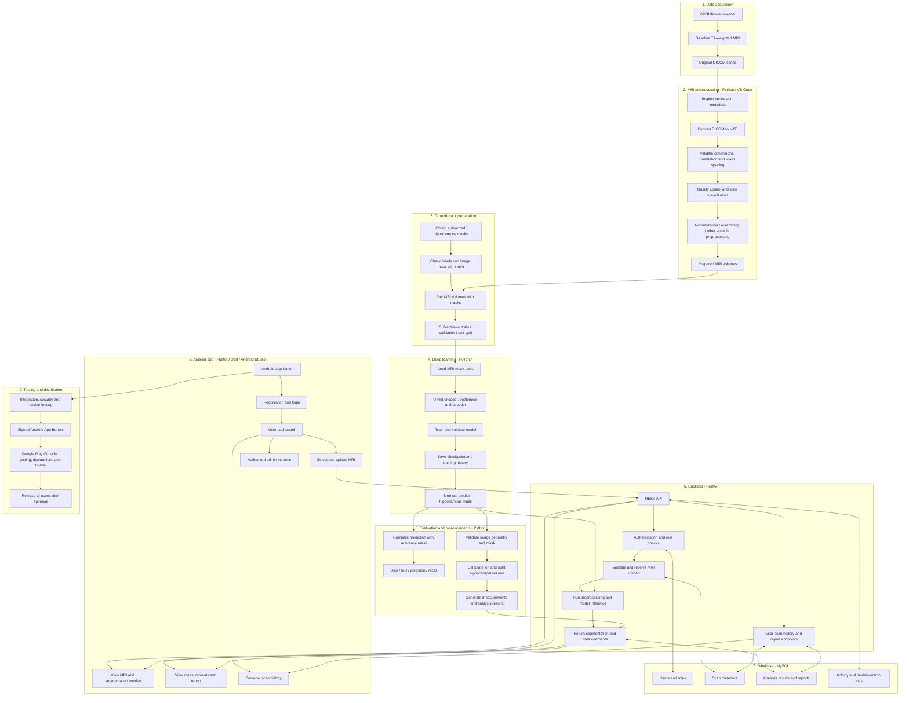

# Alzheimer’s Disease Detection Using Hippocampus Segmentation with U-Net

An AI-assisted research project that aims to segment the hippocampus from brain MRI scans using a U-Net model and provide analysis through an Android application. The planned mobile app will communicate with a Python backend and may be distributed through the Google Play Store after implementation, testing, and approval.

> **Project status:** Initial dataset conversion and quality checks have been completed for five test MRI volumes. Model training, segmentation evaluation, backend implementation, Android app development, and Play Store publication are still pending. This is a research prototype, not a medical diagnostic device.

## Table of Contents

| No. | Section | Description |
|---:|---|---|
| 1 | [Project Overview](#project-overview) | Introduction and project status |
| 2 | [Objectives](#objectives) | Main project goals |
| 3 | [System Architecture](#system-architecture) | Planned system modules and connections |
| 4 | [Technology Stack](#technology-stack) | Frameworks, tools, and technologies |
| 5 | [Programming Languages Used and Planned](#programming-languages-used-and-planned) | Languages used or planned for development |
| 6 | [Dataset and Current Progress](#dataset-and-current-progress) | Dataset details and completed preprocessing work |
| 7 | [Project Structure](#project-structure) | Repository organization |
| 8 | [Team Responsibilities](#team-responsibilities) | Work allocation among four members |
| 9 | [Member-wise and Overall Project Completion](#member-wise-and-overall-project-completion) | Provisional progress estimates for each member and the project |
| 10 | [Development Roadmap](#development-roadmap) | Planned implementation stages |
| 11 | [Setup](#setup) | Environment setup instructions |
| 12 | [Planned Application Workflow](#planned-application-workflow) | Intended app usage flow |
| 13 | [Evaluation Plan](#evaluation-plan) | Model evaluation measures |
| 14 | [Privacy and Security](#privacy-and-security) | Data protection considerations |
| 15 | [Limitations](#limitations) | Current constraints |
| 16 | [Future Enhancements](#future-enhancements) | Possible future work |
| 17 | [Acknowledgment](#acknowledgment) | Dataset and project acknowledgments |
| 18 | [Disclaimer](#disclaimer) | Research-use notice |

## Project Overview

Alzheimer’s disease is associated with changes in brain structure, including the hippocampus. This project explores the use of deep learning to segment the hippocampus from T1-weighted brain MRI scans. The intended system combines MRI data conversion and preprocessing, U-Net segmentation, evaluation and measurement, a Python backend, and an Android application.

The system is being developed as a research and educational project. It must not be used to make clinical decisions.

## Objectives

- Organize and validate ADNI MRI data.
- Convert DICOM image series to NIfTI volumes.
- Develop a reproducible MRI preprocessing pipeline.
- Obtain and verify hippocampus segmentation masks.
- Train and evaluate a U-Net segmentation model.
- Calculate hippocampal measurements from verified masks.
- Develop backend APIs to connect the model and mobile app.
- Build an Android app for MRI upload, result visualization, and scan history.
- Prepare the app for testing and possible Google Play Store distribution.

## System Architecture

### High-level system architecture



### Detailed module descriptions

| Module | Input | Processing | Output |
|---|---|---|---|
| Dataset acquisition | ADNI MRI data | Organize scans by subject and series; follow dataset access conditions | Original MRI files and metadata |
| DICOM conversion | DICOM series | Read image series and convert to NIfTI while checking spatial metadata | NIfTI volumes |
| Preprocessing and QC | NIfTI volumes | Validate dimensions/orientation/spacing; perform suitable normalization, resampling and quality checks | Validated MRI volumes and QC reports |
| Mask preparation | Authorized hippocampus labels | Confirm label meaning, geometry and alignment; pair masks with MRI | Verified MRI-mask pairs |
| Dataset splitting | Verified pairs | Split by subject to avoid leakage between partitions | Training, validation and test sets |
| U-Net training | Training pairs | Learn image-to-mask mapping; monitor validation; save checkpoints | Trained segmentation model |
| Inference | New, supported MRI volume | Apply the same required preprocessing and run the trained model | Predicted hippocampus mask |
| Evaluation | Predictions and reference masks | Calculate Dice, IoU, precision and recall; inspect errors | Evaluation metrics and plots |
| Measurement | Validated mask and voxel geometry | Calculate left/right volumes and related measurements | Quantitative results |
| FastAPI backend | App requests and uploaded files | Authenticate, authorize, validate, invoke processing and return results | API responses and controlled access |
| MySQL database | Account and analysis metadata | Store records with ownership and access controls | Persistent application records |
| Android app | User input and API responses | Handle login, upload, visualization, history and reports | Mobile user experience |
| Release pipeline | Tested app build | Sign bundle, complete Play Console declarations/testing/review | Published app if approved |

> **Important:** This diagram represents the target architecture. Several modules—especially verified mask preparation, model training, backend, database, and Android app—are still planned and must not be considered implemented until tested.

## Technology Stack

| Component | Planned technology | Purpose |
|---|---|---|
| MRI dataset | ADNI | Source of brain MRI data |
| Image format | DICOM, NIfTI | MRI input and processing |
| Development environment | VS Code | Python and backend development |
| Image processing | SimpleITK, NiBabel, NumPy | Reading and processing MRI volumes |
| Data analysis | Pandas, Matplotlib | Reports and visualizations |
| Deep learning | PyTorch | U-Net implementation and training |
| Backend | Python, FastAPI | APIs and model inference |
| Database | MySQL | User, scan, and analysis records |
| Mobile app | Flutter, Dart, Android Studio | Android user interface |
| Version control | Git, GitHub | Collaboration and source management |
| Distribution | Android App Bundle, Google Play Console | App release, subject to requirements and review |

## Programming Languages Used and Planned

| Language | Where it is used | Purpose | Status |
|---|---|---|---|
| **Python** | MRI preprocessing, U-Net model, evaluation scripts, FastAPI backend | Image processing, deep learning, data analysis, API services | Used for initial conversion and QC; further modules planned |
| **Dart** | Flutter Android application | Mobile screens, navigation, API communication and result display | Planned for app development |
| **SQL** | MySQL database | Create and query user, scan, analysis, report and activity records | Planned for backend/database implementation |
| **PowerShell** | Windows development terminal | Create environments, install packages, run scripts and manage the project | Used for local development commands |
| **Markdown** | `README.md` and project documentation | Document setup, architecture, progress and usage | In use |
| **Mermaid** | Architecture diagram in this README | Describe the system workflow and module relationships | Used in documentation |
| **YAML** | Potential configuration and CI files | Store structured configuration or automation workflows, if introduced | Optional / not confirmed as implemented |

**Primary programming languages:** Python for AI and backend development, Dart for the Android application, and SQL for database operations. Markdown and Mermaid are used for documentation, while PowerShell supports the Windows development workflow.

## Dataset and Current Progress

The project uses baseline T1-weighted MRI data from the Alzheimer’s Disease Neuroimaging Initiative (ADNI). Follow the dataset provider’s access conditions and data-use agreement.

### Confirmed initial results

| Item | Current result |
|---|---|
| DICOM files identified | 830 |
| MRI volumes converted in the test subset | 5 |
| Successful conversions in that subset | 5 |
| Conversion failures in that subset | 0 |
| Typical converted volume dimensions | 256 × 256 × 166 |
| Approximate voxel spacing | 1.016 × 1.016 × 1.2 mm |
| Initial QC volumes checked | 5 |
| QC warnings/rejections in the reported test run | 0 |

These results describe only the five-volume test subset. The current QC-accepted files should not be described as fully normalized or completely preprocessed; additional preprocessing and validation remain to be done.

### Existing reports and visualizations

- `results/dicom_conversion_report.csv`
- `results/preprocessing_qc_report_*.csv`
- `results/plots/` — MRI slice quality-control plots

Large raw datasets, private data, virtual environments, generated caches, and model weights should not be committed to Git unless the project has an approved storage and sharing plan.

## Project Structure

The repository may evolve as implementation proceeds. A suggested structure is:

```text
Alzheimer-Hippocampus-Segmentation/
├── preprocessing/
│   ├── dicom_to_nifti.py
│   └── image_preprocessing.py
├── backend/
│   ├── app/
│   ├── api/
│   ├── database/
│   └── main.py
├── android_app/
│   ├── lib/
│   ├── android/
│   └── pubspec.yaml
├── models/
├── results/
│   └── plots/
├── documentation/
├── .gitignore
└── README.md
```

Keep original MRI data outside the repository or in an approved private data store. The exact folders may differ from this suggested layout.

## Team Responsibilities

The work is divided into four approximately equal responsibility areas. The percentages refer to planned workload, not a claim that every member has completed that share.

| Member | Responsibility | Main tasks | Deliverables |
|---|---|---|---|
| Member 1 | Dataset collection and MRI preprocessing | Collect and organize ADNI data; convert DICOM to NIfTI; validate dimensions and metadata; perform normalization, resampling, and other suitable preprocessing; prepare and verify masks; create subject-level data splits; generate QC reports. | Organized dataset, conversion/preprocessing scripts, verified MRI-mask pairs, QC reports, split files. |
| Member 2 | U-Net model development and training | Study and implement U-Net; build data loaders; select suitable losses; apply augmentation; train and validate the model; save checkpoints and training history; generate predictions; provide an inference function. | U-Net implementation, training pipeline, trained checkpoint, training graphs, predicted masks, inference interface. |
| Member 3 | Evaluation, hippocampal analysis, and backend | Evaluate segmentation using appropriate metrics; analyze errors; calculate hippocampal volumes and asymmetry; build FastAPI endpoints; connect MySQL; integrate the trained model; implement authentication and access controls; test APIs. | Evaluation report, measurement module, backend APIs, database integration, API documentation. |
| Member 4 | Android app, integration, and release preparation | Develop Flutter screens; implement login, upload, result display, history, and reports; connect APIs; create app icon; test on Android devices; build signed AAB; prepare store listing and testing materials. | Android app, app icon, integrated interface, tested release bundle, Play Store listing materials. |

All members contribute to weekly meetings, project diaries, code reviews, integration testing, final documentation, review presentations, and the final demonstration.


## Member-wise and Overall Project Completion

The percentages below are **provisional progress estimates** based on the work completed and implementation status currently documented in this repository. They are not automatically calculated from Git commits or a formal assessment. Planning and study are acknowledged, but are not counted as completed implementation.

| Member | Assigned responsibility | Estimated completion | Current status |
|---|---|---:|---|
| Member 1 | Dataset collection and preprocessing | 35% | ADNI data organization, DICOM-to-NIfTI conversion, and initial quality checks have been completed for five test MRI volumes. Ground-truth masks, complete preprocessing, and dataset splitting remain pending. |
| Member 2 | U-Net model development | 0% | Model architecture and workflow have been studied/planned; implementation, training, and validation remain pending. |
| Member 3 | Evaluation, hippocampal analysis, and backend | 0% | Evaluation metrics, measurements, API, and database have been planned; implementation remains pending. |
| Member 4 | Android application, integration, and release | 10% | Application architecture and release planning have started; app implementation, integration, testing, and publication remain pending. |
| **Overall project** | **All four members** | **11.25% (approximately 11%)** | **Estimated average of the four member completion percentages.** |

**Calculation:** (35% + 0% + 0% + 10%) ÷ 4 = **11.25%**.

> **Note:** This is an approximate planning figure, not a verified measurement of all project tasks. Update the table as implementation milestones are completed. The five-volume conversion and QC test does not mean that the complete dataset has been preprocessed or that the U-Net model has been trained.

## Development Roadmap

| Phase | Activities | Status |
|---|---|---|
| 1. Research and setup | Topic selection, literature survey, repository, environment, project planning | Initial work completed |
| 2. Dataset acquisition and conversion | ADNI data organization, DICOM-to-NIfTI conversion, initial validation | Completed for five test volumes |
| 3. Full MRI preprocessing | Normalization, resampling, additional suitable processing, QC | Pending |
| 4. Mask preparation | Obtain masks, verify alignment and labels, pair with MRI, subject-level splits | Pending |
| 5. U-Net development | Implement, train, validate, save model, generate predictions | Pending |
| 6. Evaluation and analysis | Dice, IoU, precision, recall, error analysis, volume measurements | Pending |
| 7. Backend | FastAPI, MySQL, authentication, upload and inference endpoints | Pending |
| 8. Android application | Flutter UI, API integration, visualization, history, reports | Pending |
| 9. Testing and release | Integration/device tests, privacy documentation, signed AAB, closed testing, Play Store review | Pending |

## Setup

### Prerequisites

- Windows 10/11 or a compatible development environment.
- Python version compatible with the selected PyTorch and image-processing packages.
- VS Code, Git, Android Studio, and Flutter SDK for mobile development.
- Access to ADNI data under its applicable terms.
- MySQL for the planned backend.

### Clone the repository

```powershell
git clone https://github.com/minnachirakkal775-bot/Alzheimer-Hippocampus-Segmentation.git
cd Alzheimer-Hippocampus-Segmentation
```

### Create and activate a Python virtual environment

```powershell
py -m venv .venv
.\.venv\Scripts\Activate.ps1
python -m pip install --upgrade pip
```

Install dependencies from the maintained requirements file when available:

```powershell
pip install -r requirements.txt
```

If a requirements file has not yet been created, install and pin the dependencies used by implemented scripts before sharing the environment. Check package compatibility rather than assuming arbitrary versions will work together.

### Run the existing conversion script

After placing authorized DICOM data in the configured input location and checking the script’s path settings:

```powershell
python preprocessing/dicom_to_nifti.py
```

### Run the existing quality-checking script

```powershell
python preprocessing/image_preprocessing.py
```

Review the generated CSV reports and plots. These scripts currently support the initial conversion/QC workflow; they do not imply that all planned preprocessing steps have been implemented.

### Mobile app setup

After the Flutter project has been created:

```powershell
flutter doctor
flutter pub get
flutter run
```

Configure the API base URL to point to a backend reachable from the emulator or physical device. `localhost` on a phone does not automatically refer to the development computer.

## Planned Application Workflow

1. A user signs in to the Android application.
2. The user selects an MRI file in a supported format.
3. The app sends the file securely to the backend.
4. The backend validates the file and runs the configured preprocessing and model inference pipeline.
5. The model generates a hippocampus segmentation.
6. Measurements are calculated only after the mask and image geometry have been validated.
7. The backend stores authorized scan and analysis records.
8. The app displays the image, segmentation overlay, measurements, and report.
9. Users can view their own scan history. Administrative access must be role-controlled and logged.

## Evaluation Plan

The segmentation model will be evaluated against verified ground-truth masks using held-out subjects. Planned metrics include:

- **Dice similarity coefficient:** overlap between predicted and reference masks.
- **Intersection over Union (IoU):** intersection divided by union of predicted and reference regions.
- **Precision:** proportion of predicted positive voxels that are correct.
- **Recall:** proportion of reference positive voxels recovered by the model.

Report the evaluation split, sample count, metric definitions, and limitations. Do not report performance values until the corresponding experiments have been run and checked.

## Privacy and Security

MRI data can be sensitive. Before making the app available to other users:

- Follow ADNI data-use terms and do not redistribute restricted data.
- Collect only information required by the application.
- Use secure transport for uploads and API requests.
- Enforce authentication, role-based permissions, and record ownership on the backend.
- Do not rely only on hiding controls in the mobile interface for access control.
- Restrict and log administrative access to sensitive records.
- Define secure storage, retention, deletion, backup, and incident-handling procedures.
- Publish an accurate privacy policy and complete applicable Google Play Data safety declarations.
- Use synthetic or otherwise authorized test data during development and demonstrations.

## Limitations

- Initial conversion and QC results cover only five MRI volumes.
- Verified hippocampus masks have not yet been confirmed for the current test subset.
- U-Net training and held-out evaluation have not been completed.
- Segmentation performance and clinical validity are therefore unknown.
- Alzheimer’s stage classification would require suitable labels, adequate data, and separate validation; it is not established by hippocampus segmentation alone.
- The Android app, backend, and Play Store release are planned work, not completed deliverables.

## Future Enhancements

- Complete and validate the full preprocessing pipeline.
- Train and compare baseline U-Net with suitable variants such as Attention U-Net, if resources and data permit.
- Add robust 2D/3D visualization and longitudinal analysis where repeat scans are available.
- Explore classification only with appropriate labels and rigorous validation.
- Add explainability features with clear limitations.
- Improve accessibility, usability, and multilingual support.
- Conduct broader testing and prepare a secure production deployment.

## Acknowledgment

The project uses MRI data from the Alzheimer’s Disease Neuroimaging Initiative (ADNI), subject to its access requirements and data-use conditions. The team acknowledges the researchers, institutions, participants, and supporting organizations involved in making the dataset available.

## Disclaimer

This application is an academic research prototype. It is not intended to diagnose, treat, cure, or prevent Alzheimer’s disease or any other medical condition. Outputs must not replace assessment by qualified healthcare professionals. No claim of clinical accuracy or reliability should be made without appropriate independent validation and regulatory review.
